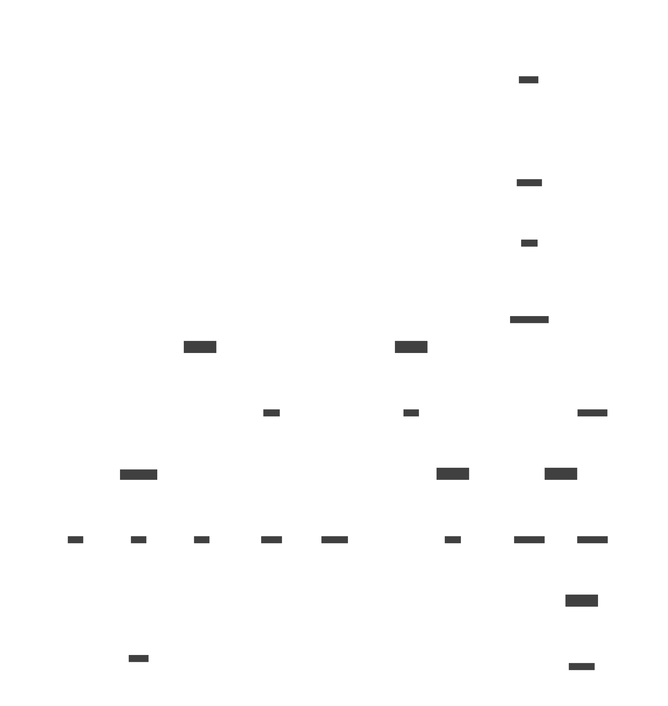

# Diagrams

|VLAN|Name|CIDR|
|----|----|----|
|1|Mgmt|192.168.1.0/24|
|10|Trusted|192.168.10.0/24|
|42|Servers|192.168.42.0/24|
|50|Guest|192.168.50.0/24|
|66|Gaming|192.168.66.0/24|
|70|IoT|192.168.70.0/24|
|90|CCTV|192.168.90.0/24|
|100|VPN|192.168.100.0/24|

───── &rarr; Cable

─ ─ ─ ─ &rarr; WiFi

## Home Network Diagram

## K8s Diagram
